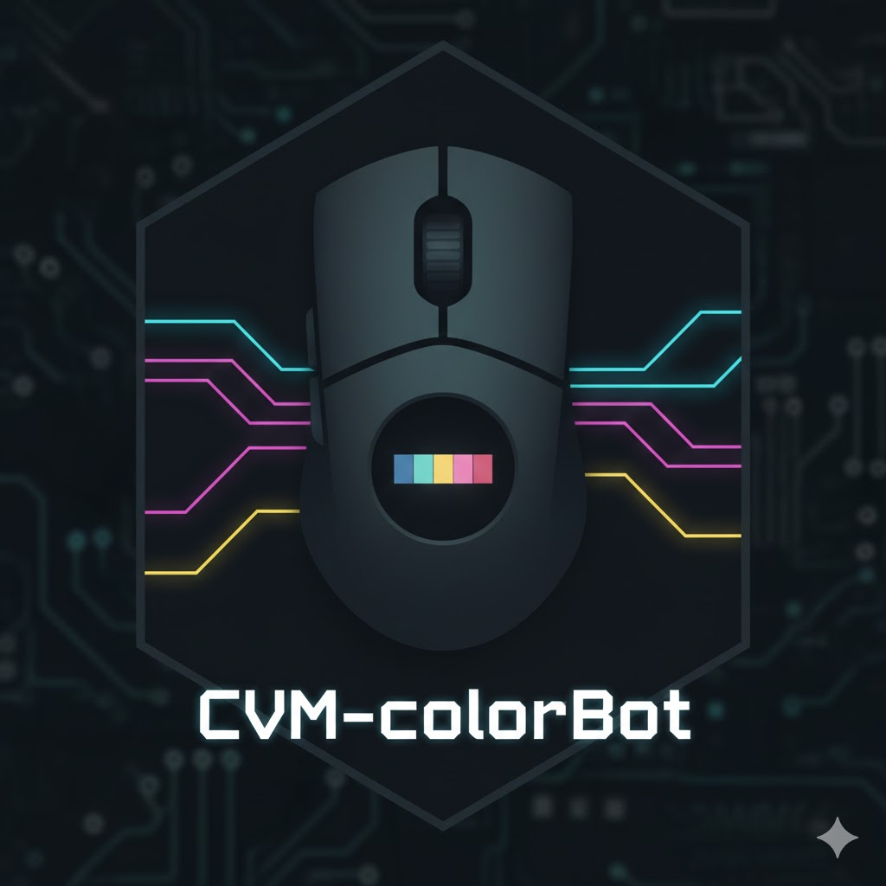

<div align="center">
  
  
  # CVM-colorBot
  
  [](https://discord.gg/pJ8JkSBnMB)
</div>

CVM-colorBot is a computer-vision mouse aiming system using HSV color detection. It supports multiple video capture sources (NDI, UDP, Capture Card, GStreamer, MSS) and multiple mouse-control backends (Serial/MAKCU, Arduino, SendInput, Net, KmboxA, MakV2, DHZ, Ferrum). Customizable sensitivity, smoothing, FOV, and anti-smoke filtering make it suitable for precise 2-PC or single-PC aiming workflows.

## Features

### Core Modules
- **Aimbot**: Intelligent targeting system with multiple modes (head/body/nearest)
- **Triggerbot**: Automated trigger with burst firing and cooldown management
- **RCS (Recoil Control System)**: Automatic recoil compensation
- **Anti-Smoke Detection**: Advanced filtering to avoid targeting through smoke

### Video Capture Support

Multiple capture backends for different 2-PC or single-PC setups:

| Backend | Description | Typical Use |
|--------|-------------|-------------|
| **NDI** | Network Device Interface; low-latency video over LAN from NDI sources (e.g. OBS, NDI Tools). | Dual-PC: game PC sends NDI, aim PC receives. |
| **UDP** | OBS-compatible UDP video streaming; configurable IP and port. | Dual-PC: OBS or other encoder sends UDP stream. |
| **Capture Card** | Direct capture from capture cards via DirectShow/Media Foundation. | Dual-PC: HDMI from game PC into capture card on aim PC. |
| **Capture Card (GStreamer)** | Optional capture-card backend using GStreamer; requires [GStreamer](docs/shared-guides/zh-CN/GStreamer-install.md) installed. | When DirectShow/Media Foundation is insufficient. |
| **MSS** | Built-in screen capture (Multiple Screen Shot); no extra hardware. | Single-PC or testing; captures local screen. |

- **Unified interface**: One capture service switches between NDI, UDP, Capture Card, GStreamer, or MSS.
- **Resolution & FPS**: Configurable per backend where supported.

### Hardware Integration

Mouse control can be done via several backends. Choose one in the Config tab (Mouse API).

| Backend | Connection | Notes |
|--------|------------|--------|
| **Serial** | USB serial (MAKCU or compatible adapter) | MAKCU (1A86:55D3), CH343, CH340, CH347, CP2102. Baud rate up to 4 Mbps. |
| **Arduino** | USB serial (Arduino-compatible) | Configurable port and baud (default 115200). |
| **SendInput** | Windows API | No extra hardware; uses Windows SendInput for mouse/keyboard. |
| **Net** | Network (TCP + DLL) | Remote mouse control via network; requires KMNet DLL and device on network. |
| **KmboxA** | USB (VID/PID) | KmboxA device; configure VID/PID in config. |
| **MakV2** / **MakV2Binary** | USB serial | MakV2 devices; configurable port and baud (e.g. 4Mbps). |
| **DHZ** | Network (IP + port) | DHZ device over network; IP, port, and optional random shift. |
| **Ferrum** | Serial (device path) | Ferrum device; serial connection. |

- **Auto-connect**: Optional startup connection to the selected Mouse API.
- **Button masking & movement lock**: Supported on Serial, MakV2, MakV2Binary, and others where applicable.
- **Keyboard output**: Available on Serial, SendInput, Net, KmboxA, MakV2, MakV2Binary, DHZ, Ferrum (see UI for per-backend behavior).

### Customization Options
- Adjustable sensitivity and smoothing
- Configurable FOV (Field of View) settings
- Granular display and overlay controls
- Real-time performance monitoring

## Requirements

### Hardware
- **MAKCU USB Device** (or compatible serial adapter: CH343, CH340, CH347, CP2102)
- Windows 10/11
- USB port for MAKCU connection

### Software
- **Python 3.11 to 3.13.x** (e.g. 3.11.x, 3.12.x, 3.13.7). Tested up to 3.13.7; **Python 3.14 is not supported**. (Dependencies such as NumPy 2.2.x officially support 3.10–3.13; 3.11+ is recommended.)
- Windows operating system (10/11)

## Installation

### Method 1: Quick Setup (Recommended)

1. **Clone the repository**
   ```bash
   git clone https://github.com/asenyeroao-ct/CVM-colorBot.git
   cd CVM-colorBot
   ```

2. **Run the setup script**
   ```bash
   setup.bat
   ```
   This will automatically:
   - Check Python installation
   - Create a virtual environment
   - Install all dependencies

3. **Run the application**
   ```bash
   run.bat
   ```

### Method 2: Manual Setup

1. **Clone the repository**
   ```bash
   git clone https://github.com/asenyeroao-ct/CVM-colorBot.git
   cd CVM-colorBot
   ```

2. **Create a virtual environment** (recommended)
   ```bash
   python -m venv venv
   venv\Scripts\activate
   ```

3. **Install dependencies**
   ```bash
   pip install -r requirements.txt
   ```

4. **Run the application**
   ```bash
   python main.py
   ```
   
   Or use the provided batch file:
   ```bash
   run.bat
   ```

## Usage

### Initial Setup

1. **Connect MAKCU Device**
   - Plug in your MAKCU USB device
   - The application will automatically detect and connect

2. **Configure Video Source**
   - Select capture method: NDI, UDP, or Capture Card
   - Configure connection settings based on your selected method
   - Click "CONNECT" to establish connection

3. **Adjust Settings**
   - Navigate through tabs: General, Aimbot, Sec Aimbot, Trigger, RCS, Config
   - Configure sensitivity, smoothing, FOV, and other parameters
   - Settings are automatically saved to `config.json`

### Configuration Tabs

- **General**: Capture controls, sensitivity, operation mode, target color
- **Aimbot**: Main aiming settings, sensitivity, FOV, offsets, targeting mode
- **Sec Aimbot**: Secondary aimbot configuration
- **Trigger**: Triggerbot settings, delay, hold, burst controls
- **RCS**: Recoil control system parameters
- **Config**: Save/load configuration profiles

## Project Structure

```
CVM-colorBot/
├── main.py                 # Main application entry point
├── requirements.txt        # Python dependencies
├── config.json            # Application configuration
├── run.bat                # Windows launcher
├── setup.bat              # Setup script
├── src/
│   ├── ui.py              # GUI interface (CustomTkinter)
│   ├── aim_system/        # Aiming system modules
│   │   ├── normal.py      # Normal mode aimbot
│   │   ├── silent.py      # Silent mode aimbot
│   │   ├── Triggerbot.py  # Triggerbot logic
│   │   ├── RCS.py         # Recoil control system
│   │   └── anti_smoke_detector.py
│   ├── capture/           # Video capture modules
│   │   ├── capture_service.py   # Unified capture service
│   │   ├── ndi.py               # NDI capture
│   │   ├── OBS_UDP.py          # UDP streaming (OBS-compatible)
│   │   ├── CaptureCard.py      # Capture card (DirectShow/Media Foundation)
│   │   ├── CaptureCardGStreamer.py  # Capture card (GStreamer, optional)
│   │   └── mss_capture.py      # MSS screen capture
│   └── utils/             # Utility modules
│       ├── config.py      # Configuration management
│       ├── detection.py   # HSV color detection
│       ├── mouse_input.py
│       └── mouse/        # Mouse control backends (Serial, Arduino, SendInput, Net, KmboxA, MakV2, DHZ, Ferrum)
├── configs/               # Configuration profiles
└── themes/                # UI themes
```

## Configuration

Configuration is stored in `config.json` and can be managed through the GUI or manually edited. Key settings include:

- **Capture Settings**: Video source, resolution, FPS
- **Aimbot Settings**: Sensitivity, smoothing, FOV, targeting mode
- **Triggerbot Settings**: Delay, hold time, burst count, cooldown
- **RCS Settings**: Pull speed, activation delay, rapid click threshold
- **Display Settings**: OpenCV windows, overlay elements

## Supported Devices

### Mouse / Control Backends
- **Serial**: MAKCU (1A86:55D3), CH343 (1A86:5523), CH340 (1A86:7523), CH347 (1A86:5740), CP2102 (10C4:EA60)
- **Arduino**: Arduino-compatible boards over USB serial
- **SendInput**: Built-in Windows (no device required)
- **Net**: Network device with KMNet DLL
- **KmboxA**: KmboxA USB device (VID/PID configurable)
- **MakV2 / MakV2Binary**: MakV2 family over serial
- **DHZ**: DHZ device over network (IP/port)
- **Ferrum**: Ferrum device over serial

### Video Capture Sources
- **NDI**: Any NDI source on the network (e.g. NDI Tools, OBS with NDI output)
- **UDP**: Any UDP video stream (e.g. OBS UDP streaming)
- **Capture Card**: DirectShow/Media Foundation compatible capture cards
- **Capture Card (GStreamer)**: Same hardware with GStreamer pipeline (optional)
- **MSS**: Local screen capture (no capture card needed)

## Technical Details

- **Color Detection**: HSV-based color space detection for target identification
- **Mouse Control**: High-speed serial communication via MAKCU device
- **Video Processing**: OpenCV for real-time frame processing
- **GUI Framework**: CustomTkinter for modern, customizable interface
- **Multi-threading**: Asynchronous processing for smooth performance

## License

Copyright (c) 2025 asenyeroao-ct. All rights reserved.

This project is licensed under a custom license. See [LICENSE](LICENSE) file for details.

**Key Points:**
- Personal, non-commercial use is permitted
- Modification and redistribution are allowed with proper attribution
- Commercial use is prohibited without written permission
- Original author **asenyeroao-ct** must be credited in all distributions

## Disclaimer

This project is for learning and testing purposes only. This program is designed for dual-PC setups only. The author is not responsible for any game account bans, penalties, or other consequences resulting from the use of this program, and no compensation will be provided. Users must bear the risks of use and understand the possible consequences. Users are responsible for ensuring compliance with applicable laws and terms of service of any software or games used with this tool.

## Contributing

Contributions are welcome! Please feel free to submit a Pull Request.

## Support

- **Discord**: [Join our Discord server](https://discord.gg/pJ8JkSBnMB) for community support, discussions, and updates
- **GitHub Issues**: For bug reports, questions, or feature requests, please open an issue on [GitHub](https://github.com/asenyeroao-ct/CVM-colorBot/issues)

## Star History

[](https://www.star-history.com/#asenyeroao-ct/CVM-colorBot&type=date&legend=top-left)
