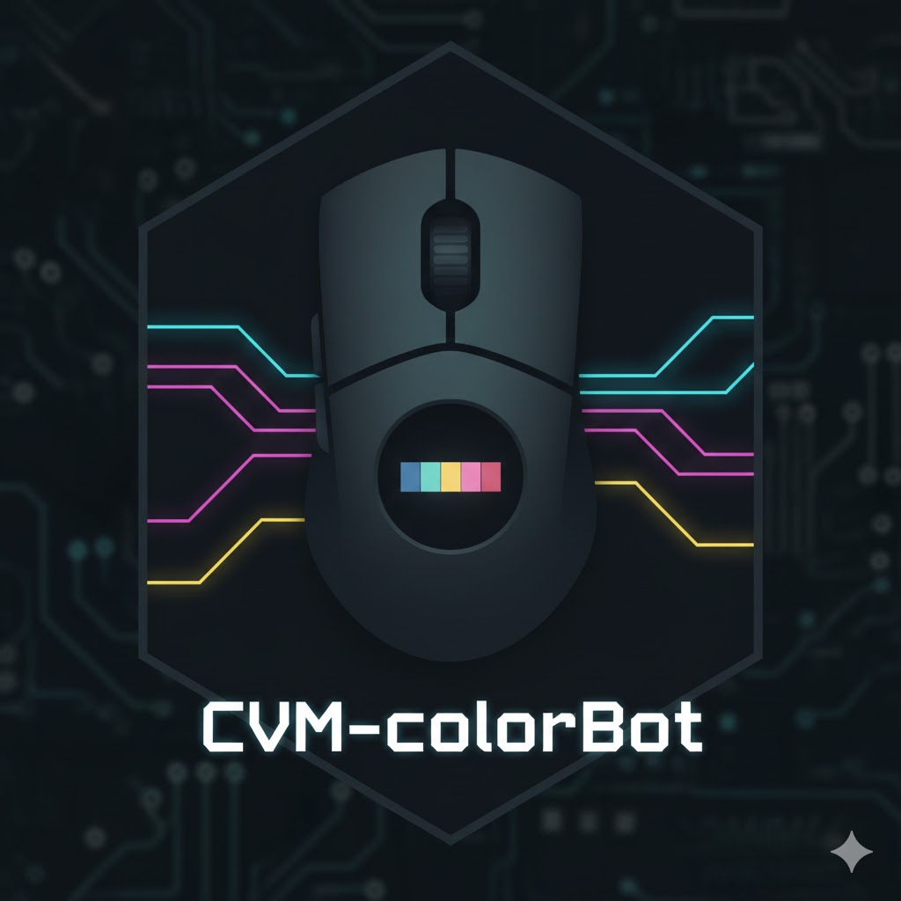

<div align="center">

  

  # CVM ColorBot

  **以 HSV 色彩辨識為核心的即時視覺追蹤與滑鼠控制工具**

  <sub>多影像來源 · 多種追蹤模式 · 多硬體後端 · 現代化圖形介面</sub>

  <br><br>

  [](version.json)
  [](https://www.python.org/downloads/)
  [](#系統需求)
  [](LICENSE)

  [](https://discord.gg/pJ8JkSBnMB)
  [](https://github.com/asenyeroao-ct/CVM-colorBot/issues)

  **繁體中文** · [简体中文](readme_cn.md)

</div>

---

> [!IMPORTANT]
> 本專案僅供學習、研究與測試使用。使用者須自行確認使用方式符合所在地法律及相關軟體或遊戲的服務條款，並自行承擔所有風險。

## 專案介紹

CVM ColorBot 透過 OpenCV 與 HSV 色彩範圍進行即時目標辨識，將影像擷取、目標追蹤、移動演算法與滑鼠輸出整合在同一套 GUI 中。它能配合單機畫面擷取，也能透過 NDI、UDP、OBS Teleport 或擷取卡建構雙電腦流程。

<div align="center">

| 多模式追蹤 | 彈性影像來源 | 多種控制後端 | 即時調校 |
| :---: | :---: | :---: | :---: |
| Normal、Flick、Silent、NCAF、WindMouse、Bezier、PID | NDI、UDP、Teleport、擷取卡、GStreamer、MSS | 軟體輸出、USB 串口與網路裝置 | FOV、靈敏度、平滑度、偏移與 HSV 範圍 |

</div>

### 主要功能

- **雙組追蹤設定** — 主、副 Aimbot 可分別配置模式、按鍵與參數。
- **Triggerbot** — 支援延遲、按住時間、連發、冷卻與辨識確認設定。
- **RCS** — 可調整後座力補償速度、啟動延遲與快速點擊門檻。
- **Anti-Smoke** — 過濾煙霧等低可信度區域，降低錯誤鎖定。
- **HSV 即時預覽** — 直接調整色彩範圍與偵測條件。
- **設定檔管理** — 自動保存目前設定，並可載入不同配置檔。
- **效能監控** — 即時檢視影像與處理狀態，方便測試與調校。

## 快速開始

### 系統需求

| 項目 | 需求 |
| --- | --- |
| 作業系統 | Windows 10 / 11（64 位元） |
| Python | 3.11 ～ 3.13.x，建議使用 3.11 或 3.12 |
| 額外硬體 | 非必要；使用 SendInput 或 MSS 時可不接外部裝置 |
| 選用元件 | NDI Runtime、OBS Teleport、GStreamer 或相容擷取卡，依影像來源而定 |

> [!WARNING]
> Python 3.14 目前不受支援。請安裝 Python 時勾選 **Add Python to PATH**。

### 自動安裝（推薦）

```bat
git clone https://github.com/asenyeroao-ct/CVM-colorBot.git
cd CVM-colorBot
setup.bat
run.bat
```

`setup.bat` 會建立 `venv` 虛擬環境並安裝所有 Python 套件；之後只需要執行 `run.bat`。

### 手動安裝

```bat
git clone https://github.com/asenyeroao-ct/CVM-colorBot.git
cd CVM-colorBot
python -m venv venv
venv\Scripts\activate
python -m pip install --upgrade pip
pip install -r requirements.txt
python main.py
```

## 首次設定

1. **選擇影像來源** — 在 Capture 頁面選擇 NDI、UDP、Teleport、擷取卡或 MSS。
2. **選擇控制方式** — 在 Hardware / Mouse API 中選擇外部裝置，或使用 Windows SendInput。
3. **校正偵測顏色** — 設定目標色彩與 HSV 範圍，透過預覽確認遮罩結果。
4. **調整追蹤參數** — 設定 FOV、靈敏度、平滑度、目標位置與啟動按鍵。
5. **建立連線** — 連接影像來源與控制後端，再逐步微調參數。

> [!TIP]
> 建議先以 **MSS + SendInput** 測試基本功能，確認偵測正常後，再切換到擷取卡、NDI 或外部控制器。

所有介面設定會保存至 `config.json`；預設配置與其他設定檔位於 `configs/`。

## 影像來源

| 來源 | 連線方式 | 適合情境 |
| --- | --- | --- |
| **NDI** | 區域網路 NDI 來源 | 雙電腦、低延遲網路影像 |
| **UDP** | IP + Port | OBS 或其他編碼器的 UDP 串流 |
| **Teleport** | OBS Teleport | 使用 Teleport 外掛傳送畫面 |
| **Capture Card (OpenCV)** | DirectShow / Media Foundation | HDMI 擷取卡的快速通用設定 |
| **Capture Card (GStreamer)** | GStreamer Pipeline | 需要自訂格式或進階擷取流程 |
| **MSS** | 本機螢幕擷取 | 單電腦測試，無需額外硬體 |

> GStreamer 模式需要另外安裝 64 位元 GStreamer Runtime，並確保其 DLL 可由系統找到。

## 控制後端

介面目前提供以下 Mouse API：

| 類型 | 支援項目 |
| --- | --- |
| **Windows 軟體輸出** | SendInput |
| **USB / Serial** | Serial (Makcu)、Arduino、MakV2、MakV2Binary、MakcuController、MakxdMakAPI、MAK API、Medius |
| **USB VID/PID** | KmboxA |
| **網路 / 複合連線** | Net、DHZ、Ferrum |

部分後端支援自動連線、鍵盤輸出、按鍵遮罩或移動鎖定；實際能力取決於裝置與韌體。連線參數可直接在 Hardware 頁面中設定。

<details>
<summary><strong>查看常見裝置識別資訊</strong></summary>

<br>

| 裝置 | VID:PID |
| --- | --- |
| MAKCU | `1A86:55D3` |
| CH343 | `1A86:5523` |
| CH340 | `1A86:7523` |
| CH347 | `1A86:5740` |
| CP2102 | `10C4:EA60` |

</details>

## 技術架構

```text
CVM-colorBot/
├─ main.py                  # 程式進入點與即時處理流程
├─ config.json              # 目前使用中的設定
├─ setup.bat / run.bat      # Windows 安裝與啟動腳本
├─ configs/                 # 可載入的配置檔
├─ locales/                 # 多語系文字
├─ themes/                  # GUI 主題與圖示
└─ src/
   ├─ aim_system/           # 追蹤模式、Triggerbot、RCS、Anti-Smoke
   ├─ capture/              # NDI、UDP、Teleport、擷取卡、MSS
   ├─ ui.py                 # CustomTkinter 圖形介面
   ├─ ui_hsv_preview.py     # HSV 即時預覽工具
   └─ utils/
      ├─ config.py          # 設定讀寫與相容處理
      ├─ detection.py       # HSV 偵測流程
      └─ mouse/             # 各種滑鼠與鍵盤控制後端
```

| 技術 | 用途 |
| --- | --- |
| **Python** | 應用程式與控制邏輯 |
| **OpenCV + NumPy** | 影像處理、遮罩與輪廓偵測 |
| **CustomTkinter** | 現代化桌面 GUI |
| **MSS / NDI / UDP / Teleport** | 即時影像輸入 |
| **PySerial / Network APIs** | 外部裝置通訊 |

## 常見問題

<details>
<summary><strong>執行 setup.bat 時找不到 Python</strong></summary>

<br>

重新安裝支援版本的 Python，並勾選 **Add Python to PATH**。完成後開啟新的終端機，執行 `python --version` 確認版本。

</details>

<details>
<summary><strong>程式能啟動，但沒有影像</strong></summary>

<br>

確認來源已在 Capture 頁面正確選取並完成連線。NDI、UDP 與 Teleport 需要檢查網路、防火牆與傳送端；擷取卡則需確認沒有被 OBS 等其他程式占用。

</details>

<details>
<summary><strong>偵測不到目標顏色</strong></summary>

<br>

先開啟 HSV 預覽，放寬 H / S / V 範圍，再逐步收窄；同時檢查最小面積、輪廓大小、FOV 與 Anti-Smoke 設定。

</details>

<details>
<summary><strong>外部控制器無法連線</strong></summary>

<br>

檢查裝置管理員中的 COM Port、VID/PID、波特率與韌體協定。網路型裝置還需要確認 IP、Port 以及本機防火牆設定。

</details>

## 參與與支援

- 發現問題或想提出功能建議：請建立 [GitHub Issue](https://github.com/asenyeroao-ct/CVM-colorBot/issues)。
- 想協助改善專案：歡迎 Fork 後提交 Pull Request。
- 交流、設定討論與更新消息：加入 [Discord 社群](https://discord.gg/pJ8JkSBnMB)。

## 授權與聲明

Copyright © 2025 **asenyeroao-ct**. All rights reserved.

本專案採用自訂授權條款，允許個人、非商業用途的使用、研究、修改與附帶原作者署名的再發布；未經書面許可不得商業使用。完整內容請參閱 [LICENSE](LICENSE)。

本軟體依「現狀」提供，不附帶任何形式的保證。作者不對帳號處分、資料損失、裝置異常或其他使用後果負責。

---

<div align="center">

  <sub>Made for learning, testing and computer-vision exploration.</sub>

  **[回到頂端](#cvm-colorbot)**

</div>
